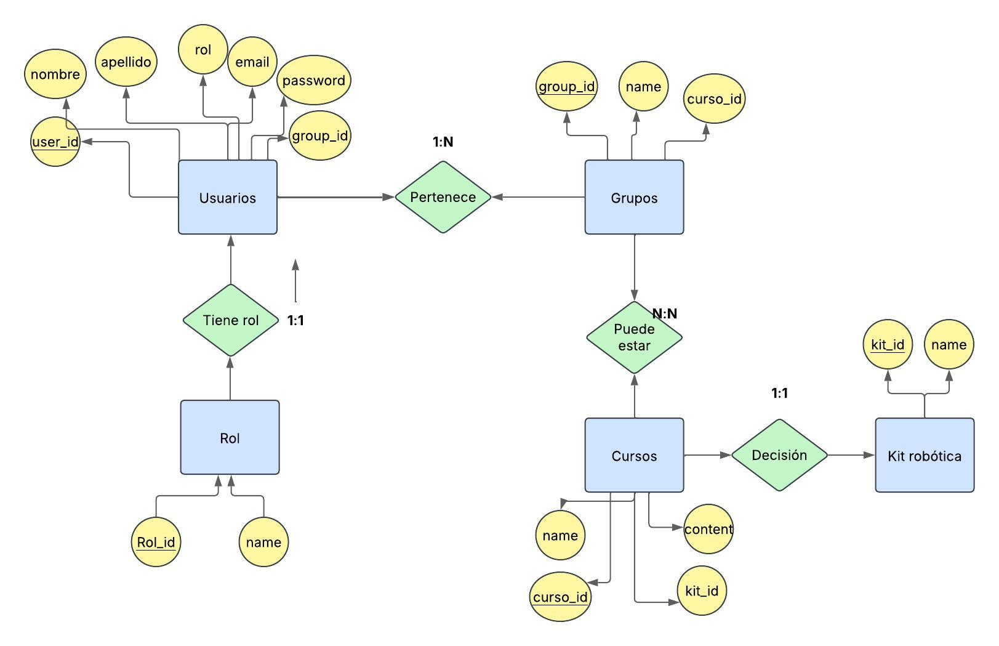

🚀 Activity 7 - Robotics Course Management System

📌 Project Name

Robotics Course Management System

📖 Project Description

Este proyecto es un sistema de gestión de cursos de robótica que permite administrar usuarios con distintos roles, asignarlos a grupos y facilitar su inscripción en cursos.

🔹 Usuarios con roles como Administrador, Profesor y Estudiante.🔹 Grupos de estudiantes asignados a diferentes cursos.🔹 Cursos vinculados a kits de robótica para su desarrollo.🔹 Kits de robótica usados en la enseñanza de cada curso.

📊 Entity-Relationship Diagram (ERD)

